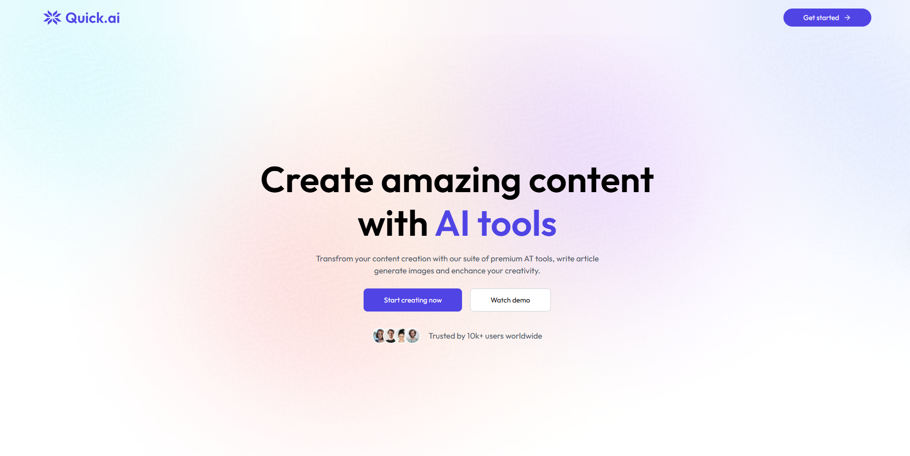
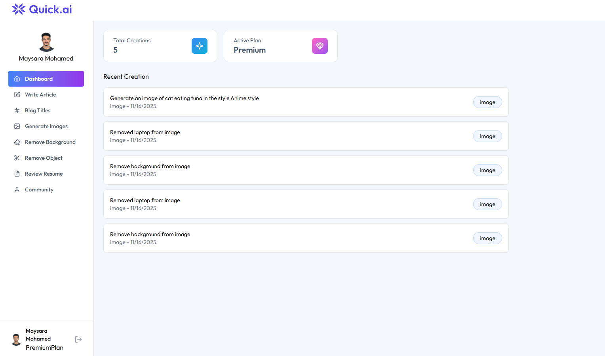
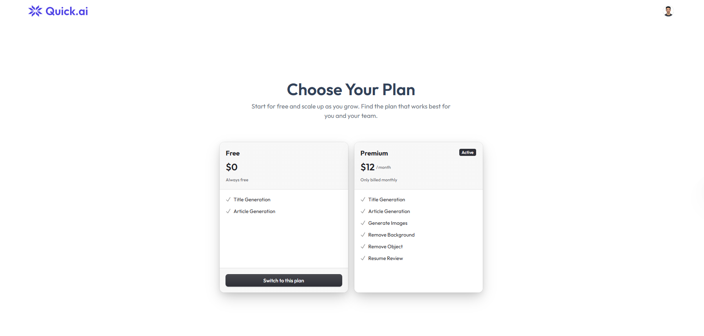
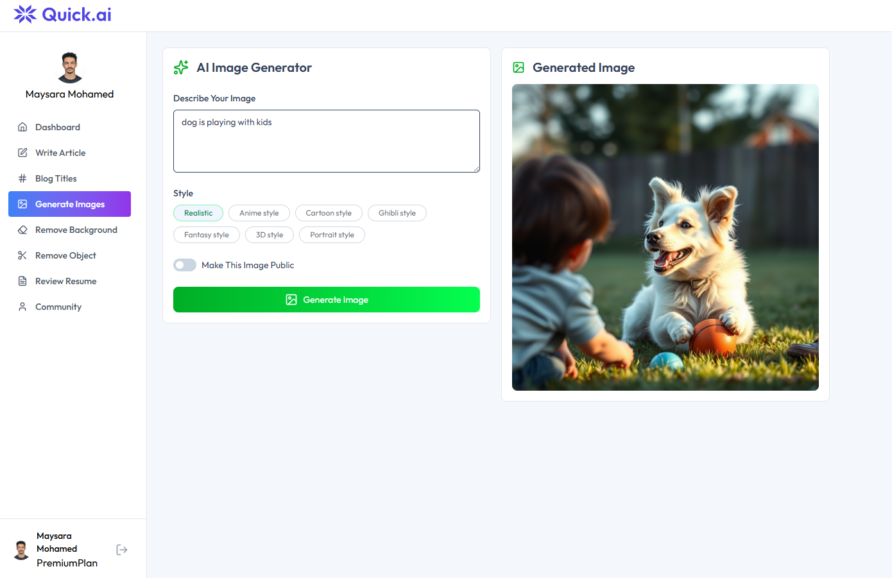
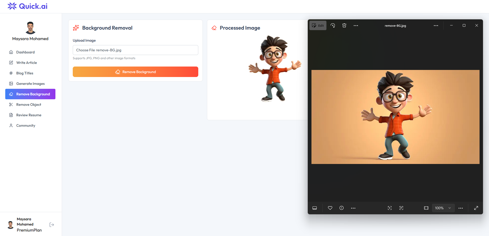
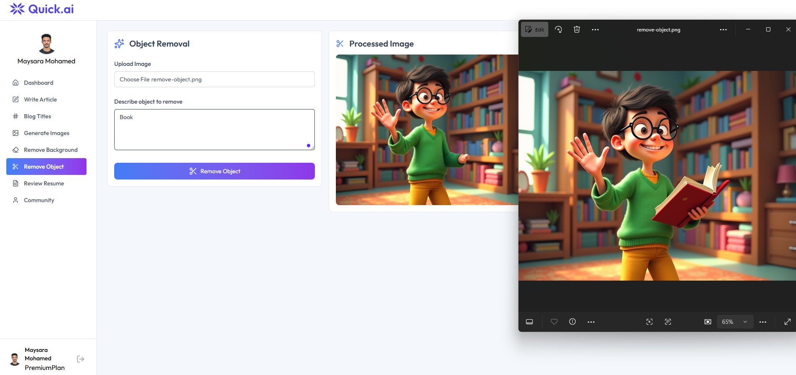
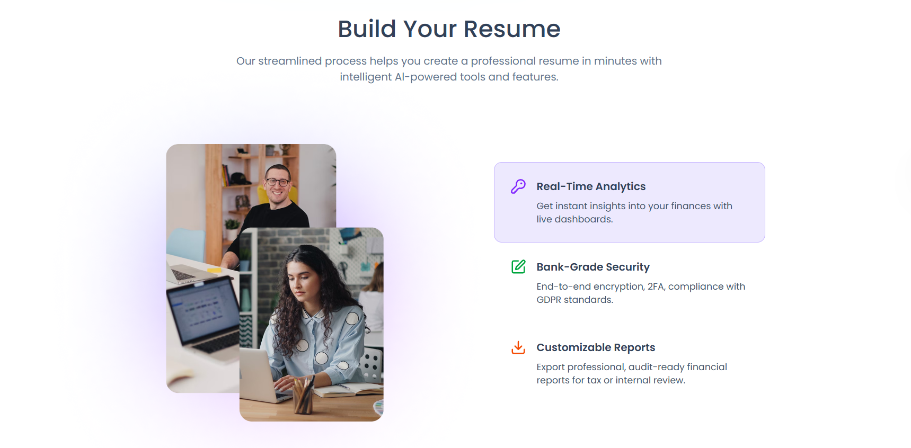

# QuickAI - AI-Powered Content Creation Platform

A full-stack SaaS platform that provides powerful AI tools for content creation, image generation, and document analysis.

## What This Project Does

QuickAI is a comprehensive AI toolkit that helps users create and enhance content with cutting-edge AI technology. The platform offers:

- AI-powered article and blog title generation
- AI image generation with multiple style options
- Advanced image editing (background removal, object removal)
- Resume review and analysis
- Community sharing for generated images
- Subscription-based access with free and premium tiers

## Features

- **User Authentication** - Secure sign-in with Clerk authentication
- **Subscription Management** - Free and premium plans with role-based access control
- **AI Article Generation** - Create full articles with customizable length using Google Gemini AI
- **Blog Title Generator** - Generate catchy blog titles by category and keyword
- **AI Image Generation** - Create images from text prompts using ClipDrop API
- **Background Removal** - Remove backgrounds from images automatically
- **Object Removal** - Remove specific objects from images using AI
- **Resume Review** - Get AI-powered feedback on your resume
- **Community Gallery** - Share and like AI-generated images
- **Usage Tracking** - Monitor free tier usage limits
- **Responsive Design** - Works seamlessly on all devices

## Screenshots

### Landing Page



### Dashboard



### AI Tools



### Image Generation



### Image Generation



### Image Generation



### Image Generation



## Technologies Used

### Frontend

- React
- React Router
- Clerk React (Authentication)
- Axios
- React Hot Toast
- Tailwind CSS
- Lucide React (Icons)
- React Markdown

### Backend

- Node.js
- Express
- PostgreSQL (Neon Database)
- Clerk Express (Authentication & Subscriptions)
- Google Gemini AI API
- ClipDrop API
- Cloudinary
- Multer (File uploads)
- OpenAI SDK
- pdf-parse

## Getting Started

### Prerequisites

- Node.js installed
- PostgreSQL database (Neon recommended)
- Clerk account for authentication
- Google Gemini API key
- ClipDrop API key (for image generation)
- Cloudinary account

### Installation

1. Clone the repository

```bash
git clone <repository-url>
```

2. Install dependencies for both client and server

```bash
cd client
npm install

cd ../server
npm install
```

3. Set up environment variables

Create a `.env` file in the server directory:

```
DATABASE_URL=your_neon_database_url
CLERK_PUBLISHABLE_KEY=your_clerk_publishable_key
CLERK_SECRET_KEY=your_clerk_secret_key
GEMINI_API_KEY=your_gemini_api_key
CLIPDROP_API_KEY=your_clipdrop_api_key
CLOUDINARY_CLOUD_NAME=your_cloudinary_name
CLOUDINARY_API_KEY=your_cloudinary_key
CLOUDINARY_API_SECRET=your_cloudinary_secret
CLIENT_URL=http://localhost:5173
PORT=3000
```

Create a `.env` file in the client directory:

```
VITE_CLERK_PUBLISHABLE_KEY=your_clerk_publishable_key
VITE_BASE_URL=http://localhost:3000
```

4. Set up the database

Create the following table in your PostgreSQL database:

```sql
CREATE TABLE creations (
    id SERIAL PRIMARY KEY,
    user_id VARCHAR(255) NOT NULL,
    prompt TEXT NOT NULL,
    content TEXT NOT NULL,
    type VARCHAR(50) NOT NULL,
    publish BOOLEAN DEFAULT FALSE,
    likes TEXT[] DEFAULT '{}',
    created_at TIMESTAMP DEFAULT CURRENT_TIMESTAMP,
    updated_at TIMESTAMP DEFAULT CURRENT_TIMESTAMP
);
```

5. Run the application

Start the server:

```bash
cd server
npm run server
```

Start the client:

```bash
cd client
npm run dev
```

## Usage

1. Sign up or log in using Clerk authentication
2. Explore the AI tools from the dashboard
3. **Free Plan Users**:
   - Get 10 free text generation credits
   - No access to image features
4. **Premium Users**:
   - Unlimited text generation
   - AI image generation
   - Background and object removal
   - Resume analysis
5. Generate content using various AI tools
6. View your creation history on the dashboard
7. Share AI-generated images with the community
8. Like and explore images created by other users

## API Rate Limiting

The application implements rate limiting to manage API usage:

- Minimum 5-second delay between requests
- Daily limit of 1400 requests
- Automatic retry with exponential backoff for 429 errors

## Subscription Tiers

### Free Plan

- 10 free text generation credits
- Article generation
- Blog title generation
- Resume review
- Access to community gallery

### Premium Plan

- Unlimited text generation
- AI image generation
- Background removal
- Object removal from images
- All free plan features

## License

This project is open source and available for personal and educational use.
